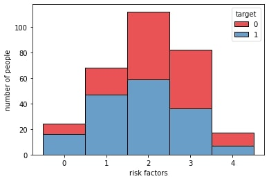

# Project 3: Heart Disease Prediction (Python/HTML)

This repository is for the analysis and modeling done on the Kaggle: Heart Disease ICU dataset. Below you will find an overview of the data, code, and results. The goal of this project was to create an end-to-end project where I perform an exploratory data analysis, prepare the data (i.e., clean and feature engineer), apply machine learning algorithms to predict heart disease, and create a [deployed application with a front end](https://predict-heart-diseases.herokuapp.com/) to productionize the best performing model. The repo for the app can be found [here](https://github.com/MichaelBryantDS/heart-disease-pred-app).

### Code Used 

**Python Version:** 3.7.10 <br />
**Packages:** pandas, numpy, sklearn, matplotlib, seaborn, warnings<br />
**For Web Framework Requirements:**  ```pip install -r requirements.txt```  

## Heart Disease Dataset

The dataset was gathered from [Kaggle](https://www.kaggle.com/ronitf/heart-disease-uci). The dataset contains 14 variables and 303 patient records.

### Variables

`age`, `sex`,`cp`, `trestbps`, `chol`, `fbs`, `restecg`, `thalach`, `exang`, `oldpeak`, `slope`, `ca`, `thal`

## Files

### eda-engineering.py

This file contains the exploratory data analysis (EDA), data cleaning, and feature engineering. The EDA is performed using descriptive statistics, histograms to determine distributions, and a correlation heatmap using the Pearson correlation coefficient. The feature engineering is performed by creating a predictor based on risk factors. The dummy variables are created for categorical variables with pandas get_dummies and the numerical features are scaled using MinMaxScaler. The scaler is pickled after fitting for use with productionization.

### modeling.py

This file contains the modeling where I hyperparameter tune: GaussianNB, LogisticRegression, DecisionTreeClassifier, kNeighborsClassifier, RandomForestClassifier, SVC (support vector classifier), XGBClassifier, StackingClassifier, (hard) VotingClassifier, (soft) VotingClassifier, BaggingClassifier, (pasting with) BaggingClassifier, and AdaBoostClassifier. Since the computational power needed is low due to having only 303 records with 12 features, I figured I could easily use 13 common ML algorithms and enesemble methods without taking too long. The models are hyperparameter tuned with GridSearchCV based on accuracy and the best models are judged based on accuracy, sensitivity, specificity, precision, and AUC metrics. This file also contains code to derive the feature importance from the best models using shap and eli5. The scaler is pickled for use with the application.

### final-model.py

This file contains the best model (SVC) and it is pickled for use with the application.

## Results

### EDA

I looked at the distributions of the data and the correlations between variables. Below are some of the highlights:

<div align="center">
  
<figure>
<br/>
  <figcaption>Figure 1: Correlation heatmap for numerical variables using Pearson correlation coefficient</figcaption>
</figure>
<br/><br/>
  
</div>

<div align="center">
  
<figure>
<br/>
  <figcaption>Figure 2: Scatter plot with linear regression lines showing maximum heart rate decreases at a greater rate with age for those with heart disease.</figcaption>
</figure>
<br/><br/>
  
</div>

<div align="center">
  
<figure>
<br/>
  <figcaption>Figure 3: Violin plot showing lower oldpeak values for those with heart disease.</figcaption>
</figure>
<br/><br/>
  
</div>

<div align="center">
  
<figure>
<br/>
  <figcaption>Figure 4: Bar plot showing minimal relationship between number of risk factors and heart disease.</figcaption>
</figure>
<br/><br/>
  
</div>

### Feature Engineering

I feature engineered using the dataset for future modeling. I made the following changes:

### Model Building

### Model Performance

<div align="center">
  
<figure>
<br/>
  <figcaption>Figure 5: Confusion matrix for the support vector classifier.</figcaption>
</figure>
<br/><br/>
  
</div>

<div align="center">
  
<figure>
<br/>
  <figcaption>Figure 6: Classification report for the support vector classifier.</figcaption>
</figure>
<br/><br/>
  
</div>

<div align="center">
  
<figure>
<br/>
  <figcaption>Figure 7: Lift curve for the support vector classifier.</figcaption>
</figure>
<br/><br/>
  
</div>


### Feature Importance

<div align="center">
  
<figure>
<br/>
  <figcaption>Figure 8: SHAP summary plot of the feature importance for the SVC model.</figcaption>
</figure>
<br/><br/>
  
</div>

<div align="center">
  
<figure>
<br/>
  <figcaption>Figure 9: Permutation importance for the stacking model.</figcaption>
</figure>
<br/><br/>
  
</div>

<div align="center">
  
<figure>
<br/>
  <figcaption>Figure 10: Graphical representation of a decision tree.</figcaption>
</figure>
<br/><br/>
  
</div>

<div align="center">

## Productionization

<div align="center">
  
<figure>
<br/>
  <figcaption>Figure 12: Front end of application using the SVC model.</figcaption>
</figure>
<br/><br/>
  
</div>

## Resources

1. [Kaggle: Heart Disease UCI](https://www.kaggle.com/ronitf/heart-disease-uci)
2. [Kaggle: Ken Jee - Titanic Project Example](https://www.kaggle.com/kenjee/titanic-project-example)
3. [Machine Learning Mastery: Stacking Ensemble Machine Learning with Python](https://machinelearningmastery.com/stacking-ensemble-machine-learning-with-python/)
4. [Machine Learning Mastery: How to Report Classifier Performance with Confidence Intervals](https://machinelearningmastery.com/report-classifier-performance-confidence-intervals/)
5. [Medium: Evaluating a Random Forest Model](https://medium.com/analytics-vidhya/evaluating-a-random-forest-model-9d165595ad56)
6. [Analytics Vidhya: AUC-ROC Curve in Machine Learning Clearly Explained](https://www.analyticsvidhya.com/blog/2020/06/auc-roc-curve-machine-learning/)
